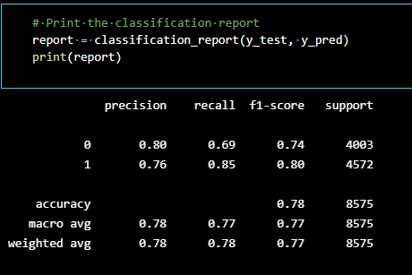

# Neural_Network_Charity_Analysis

## Overview of the analysis: Explain the purpose of this analysis.
Create a binary classifier that is capable of predicting whether applicants will be successful if unded by Alphabet Soup.

### Deliverables:
    * Deliverable 1: Preprocessing Data for a Neural Network Model
    * Deliverable 2: Compile, Train, and Evaluate the Model
    * Deliverable 3: Optimize the Model
    * Deliverable 4: A Written Report on the Neural Network Model

## Results: 

### Data Preprocessing
 - What variable(s) are considered the target(s) for your model?
    - The target was .75 as I understand it.
 - What variable(s) are considered to be the features for your model?
    - The number of columns and the data within are the extra features
 - What variable(s) are neither targets nor features, and should be removed from the input data?
    - The columns that carried only string data or tens of thousands of the same number were practically useless for this model. 

### Compiling, Training, and Evaluating the Model
 - How many neurons, layers, and activation functions did you select for your neural network model, and why?
    - The first model was run at:
        hidden_nodes_layer1 = 80
        hidden_nodes_layer2 = 50
        hidden_nodes_layer3 = 30
        And the epochs were set at 100, with len(X_train[0]) = 40
    
    - The second model was run at:
        number_input_features = len(X_train[0]) = 47
        hidden_nodes_layer1 = number_input_features * 3
        hidden_nodes_layer2 = number_input_features * 2
        hidden_nodes_layer3 = number_input_features * 1
        hidden_nodes_layer4 = 20
        And the epochs were set at 100

    - The third model was run at:
        number_input_features = len(X_train[0]) = 395
        hidden_nodes_layer1 = number_input_features * 3
        hidden_nodes_layer2 = number_input_features * 2
        hidden_nodes_layer3 = number_input_features * 1
        And the epochs were set at 100

 - Were you able to achieve the target model performance?
    - No. None of the models was able to reach the target.
    - I did trial a Random Forest Classifier that reached .77

 - What steps did you take to try and increase model performance?
    - I increased the hidden nodes, the layers of the nodes, I expanded the features by adding columns, and we pushed the limits of the model. Finally I tried a completely different model, and found better success. 

## Summary: Summarize the overall results of the deep learning model. 
The exercise was one of futility. No matter how many hidden node layers were added, the accuracy of the model did not get much better. The only thought I had was, at what point do we move on to another model (like the Random Forest Classifier)? I was able to run that model with much better success, and it did not bog down my computer for hours while running it. 

